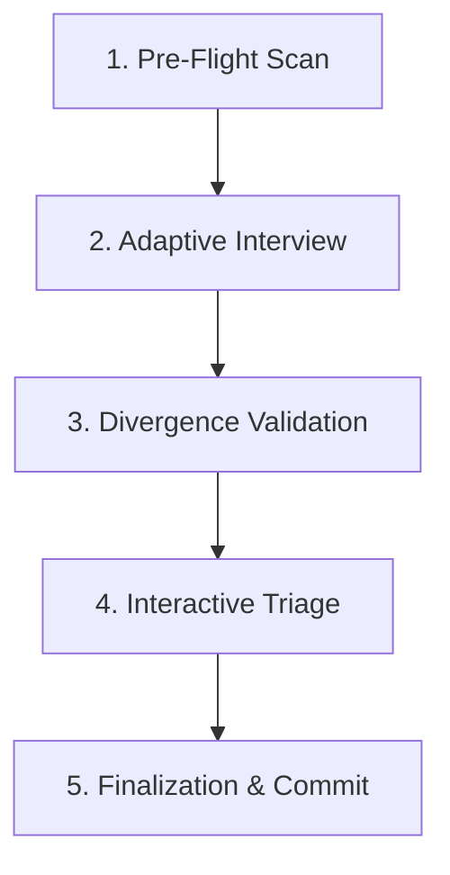

# ply (OKF Multi-Platform Onboarding Orchestrator)

**ply** is a completely portable, harness-agnostic, developer-first tool designed to generate local OKF knowledge bundles across microservices. It is delivered strictly as a standardized **Model Context Protocol (MCP) Server** running locally in the user's workspace.

---

## 1. System Vision & Philosophy

* **Separation of Concerns**:
  * **Local MCP Server**: Handles deterministic actions (scanning dependencies, parsing repository directories, reading files with safety bounds, and committing knowledge bundles to git) to keep code secure and offline.
  * **Connected AI Harness**: Performs heavy natural language processing (conducting the interview, interpreting candidate files, detecting semantic conflicts, and proposing fixes) by invoking the MCP server's tools.
* **6-File Knowledge Schema**: Every microservice onboarded generates 6 mandatory files under the local `/.knowledge/` directory:
  1. `Domain.md`: Business rules, glossary, and terminologies.
  2. `APIs.md`: API router paths and external integrations.
  3. `Architecture.md`: Framework versions, stack details, and layouts.
  4. `Data.md`: Database schema definitions and relationships.
  5. `References.md`: Local RAG references or offloaded documentation links.
  6. `Operations.md`: Log formats, metrics, and observability.

---

## 2. Onboarding Lifecycle (5 Steps)



1. **Deterministic Pre-Flight Scan**: Local scan to detect project frameworks, dependencies, configs, and candidate files.
2. **Adaptive Interview Pass**: Conversational pass with the developer to fill architectural gaps.
3. **Divergence Validation Engine**: Mismatch checking comparing interview answers to code facts.
4. **Interactive Triage**: The user chooses resolutions for each mismatch (`code_is_right` to update specs, `human_is_right` to output refactor specs, or `backlog_ticket` to log tech debt).
5. **Finalization & Local Commit**: Schema validation check and automated Git commit.

---

## 3. Getting Started

### Prerequisites
* [Node.js](https://nodejs.org/) (v18+)
* Git

### Installation
Clone the repository and install the dependencies:
```bash
git clone <repository-url> ply
cd ply
npm install
npm run build
```

---

## 4. MCP Server Configuration

To load **ply** into an MCP-capable client (like **Cursor**, **Windsurf**, **Claude Code**, or **Antigravity CLI**), register the server in your client's settings:

### Configuration JSON Example
```json
{
  "mcpServers": {
    "ply": {
      "command": "node",
      "args": ["/home/suraj/dev/ply/dist/server.js"]
    }
  }
}
```

### Registered Tools
* **`ply_scan_codebase`**: Scans package dependency manifests, runs crawls to detect config files, and classifies files into categories (apis, data, operations, architecture).
* **`ply_read_file`**: Reads candidate file content with strict repository path security limits.
* **`ply_validate_onboarding`**: Standardized rules matching interview inputs against codebase facts to generate a `DivergenceReport`.
* **`ply_resolve_divergence`**: Resolves a discrepancy by updating document specifications directly or writing refactor plans / backlog Markdown cards to the filesystem.
* **`ply_finalize_onboarding`**: Validates the 6 mandatory files, stages them, and commits them locally to Git.

---

## 5. Local CLI Testing Commands

You can run the simulated onboarding pipeline locally using the configured test runs:

* **Interactive Triage wizard (Step 4 CLI)**:
  ```bash
  npm run triage
  ```
* **Verify Schema Validation & Git Commit (Step 5)**:
  ```bash
  npm run test:finalization
  ```
* **Run Hybrid Scanners & Validation comparison**:
  ```bash
  npm run test:hybrid
  ```
* **Validate MCP stdio JSON-RPC Tool List**:
  ```bash
  npm run test:mcp
  ```

---
*Created by Ply Orchestrator - 2026*
